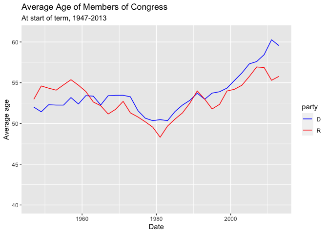

Average Age of Members of Congress
================

## Introduction

Analyzing the age of members of the United States congress over the
years. The data of interest is saved in the `congress_age` data frame
included in the `fivethirtyeight` package. To understand the data’s
context, first read:

-   The original FiveThirtyEight
    [article](https://fivethirtyeight.com/features/both-republicans-and-democrats-have-an-age-problem/)
    the data was used in. In particular the first visualization titled
    “Average Age of Members of Congress”

## Data Wrangling

``` r
avg_congress_age<- congress_age %>% 
  group_by(termstart,party) %>% 
  filter(party=="D"|party=="R") %>% 
  summarize(mean_age=mean(age)) %>% 
  select(party,termstart,mean_age)
```

    ## `summarise()` has grouped output by 'termstart'. You can override using the `.groups` argument.

``` r
avg_congress_age
```

    ## # A tibble: 68 × 3
    ## # Groups:   termstart [34]
    ##    party termstart  mean_age
    ##    <chr> <date>        <dbl>
    ##  1 D     1947-01-03     52.0
    ##  2 R     1947-01-03     53.0
    ##  3 D     1949-01-03     51.4
    ##  4 R     1949-01-03     54.6
    ##  5 D     1951-01-03     52.3
    ##  6 R     1951-01-03     54.3
    ##  7 D     1953-01-03     52.3
    ##  8 R     1953-01-03     54.1
    ##  9 D     1955-01-05     52.3
    ## 10 R     1955-01-05     54.7
    ## # … with 58 more rows

## Data Visualization

<!-- -->
